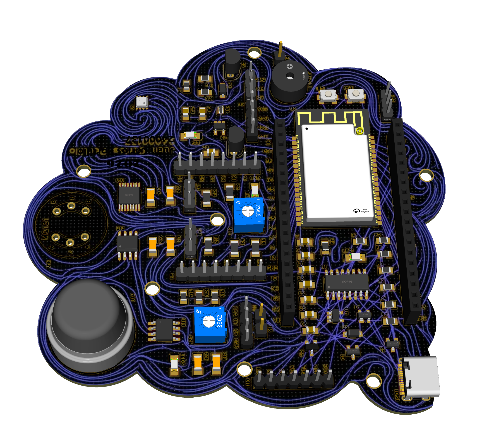
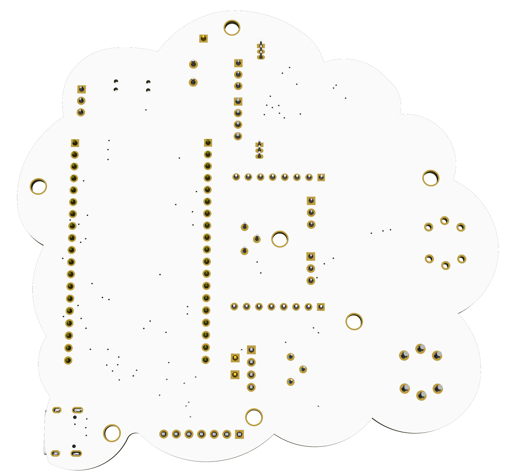

# 🌍 ToffAir IoT

> **Sistema Inteligente de Monitoreo de Calidad del Aire basado en ESP32**

ToffAir IoT es una estación inteligente de monitoreo ambiental diseñada para medir, analizar y visualizar la calidad del aire en tiempo real. El sistema integra sensores especializados para detectar dióxido de carbono (CO₂), ozono (O₃) y gases nocivos en el ambiente, procesa las mediciones mediante algoritmos de conversión y cálculo del Índice de Calidad del Aire (AQI), y presenta la información tanto de forma local en una pantalla TFT como de manera remota a través de una plataforma IoT.

El proyecto fue desarrollado utilizando un ESP32 como unidad principal de procesamiento, incorporando conectividad WiFi para transmitir datos en tiempo real hacia Adafruit IO, permitiendo el monitoreo desde cualquier dispositivo con acceso a Internet.

---

# Objetivos

* Monitorear la concentración de CO₂ en tiempo real.
* Medir la concentración de ozono (O₃) mediante un sensor de alta sensibilidad.
* Calcular automáticamente el Air Quality Index (AQI).
* Mostrar el estado del ambiente mediante una interfaz gráfica intuitiva.
* Generar alertas cuando la calidad del aire represente un riesgo.
* Almacenar y visualizar datos mediante una plataforma IoT.

---

# Características

* Medición de CO₂ mediante MQ135.
* Medición de Ozono mediante MQ131 de baja concentración.
* Conversión analógica de alta resolución utilizando MCP3551 (22 bits).
* Cálculo automático del Air Quality Index (AQI).
* Dashboard gráfico en pantalla TFT circular GC9A01.
* Sistema de alertas mediante buzzer.
* Conectividad WiFi integrada.
* Integración con Adafruit IO para monitoreo remoto.
* Historial de mediciones en la nube.
* Actualización continua de datos en tiempo real.

---

# Hardware

| Componente                | Función                                  |
| ------------------------- | ---------------------------------------- |
| ESP32 Dev Module          | Microcontrolador principal               |
| MQ135                     | Sensor de dióxido de carbono (CO₂) y gases nocivos en el ambiente       |
| MQ131 (Low Concentration) | Sensor de ozono (O₃)                     |
| MCP3551                   | Convertidor Analógico-Digital de 22 bits |
| GC9A01                    | Pantalla TFT circular                    |
| Buzzer                    | Sistema de alerta sonora                 |
| Regulador AP2112K-3.3     | Regulación de alimentación               |

---

# Imagenes del Proyecto

 

---

# Software

* Arduino IDE
* Lenguaje C++
* ESP32 Arduino Core
* Adafruit GFX
* Adafruit GC9A01
* Adafruit IO
* WiFi Library

---

# Funcionamiento

1. El ESP32 inicializa todos los periféricos del sistema.
2. Se establece la conexión WiFi.
3. Se conecta automáticamente con Adafruit IO.
4. El sensor MQ135 mide la concentración aproximada de CO₂.
5. El sensor MQ131 genera una señal analógica proporcional a la concentración de ozono.
6. El MCP3551 digitaliza la señal del MQ131 con resolución de 22 bits.
7. Se calcula la concentración estimada de ambos gases.
8. El sistema determina el nivel de calidad del aire (AQI).
9. La información se muestra en la pantalla TFT.
10. Periódicamente los datos son enviados a Adafruit IO para su almacenamiento y visualización remota.

---

# Plataforma IoT ☁️

ToffAir utiliza Adafruit IO para almacenar y visualizar las mediciones obtenidas por los sensores.

Actualmente se transmiten los siguientes parámetros:

* Concentración de CO₂ (ppm)
* Concentración de Ozono (ppb)
* Air Quality Index (AQI)

Esto permite acceder al estado del sistema desde cualquier dispositivo conectado a Internet.

---

# Interfaz

La interfaz gráfica desarrollada para la pantalla TFT muestra:

* Concentración de CO₂
* Concentración de Ozono
* Índice AQI
* Estado del aire
* Estado de conexión WiFi
* Indicadores visuales mediante colores

---

# Autor

**Juan Carlos Portillo**

Proyecto desarrollado como sistema de monitoreo inteligente de calidad del aire utilizando tecnologías IoT y sistemas embebidos.

